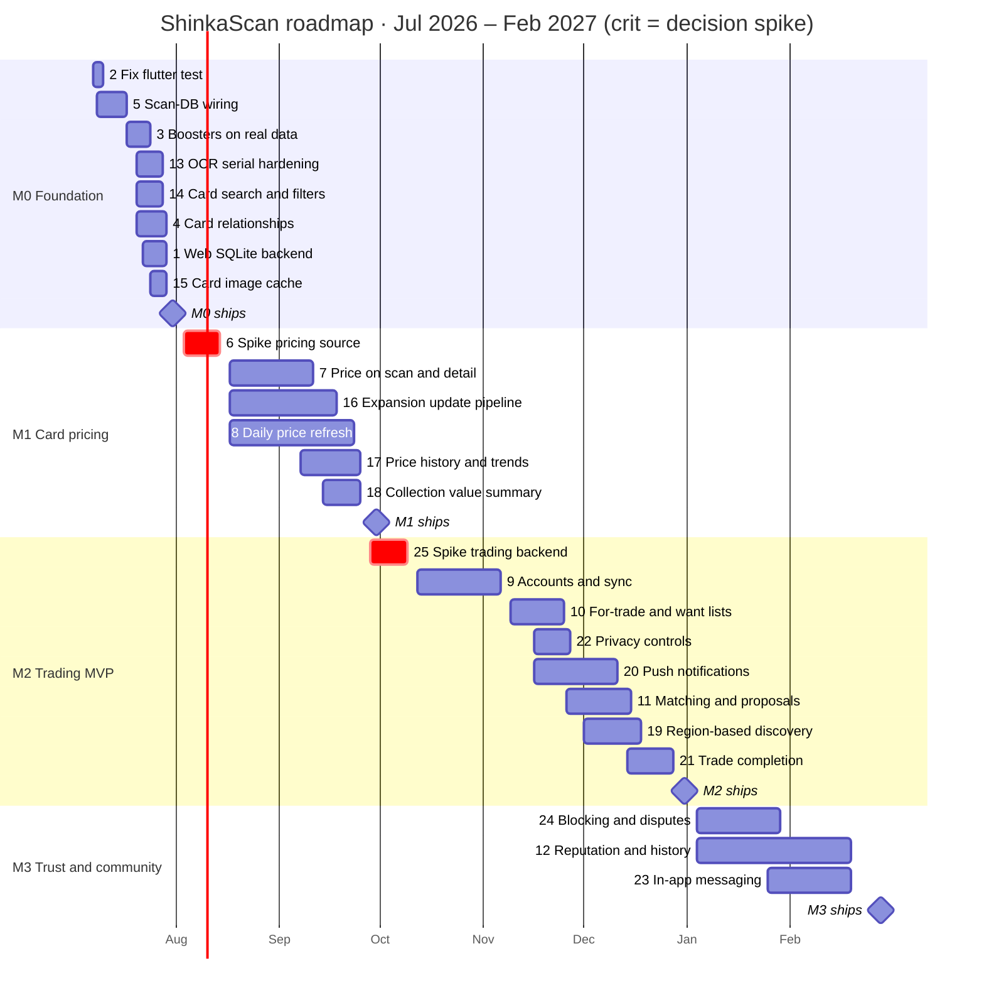

# ShinkaScan — Master Development Plan

Working plan for the full roadmap, July 2026 → February 2027. Live tracking happens on the
[project board](https://github.com/users/TrexChoong/projects/3) (Roadmap view) and the
[milestones](https://github.com/TrexChoong/shinkaScanApp/milestones); this document is the narrative map.
A read-only visual snapshot with a hoverable timeline lives at
[`master_development_plan.html`](master_development_plan.html) — open it from the repo copy and it
pulls live open/closed status and labels from GitHub; the board stays the source of truth.

**Product arc:** scan a card serial (`AE-086`) → look it up in the card database → show market price → match collectors and let them trade directly, cutting out middlemen. Releases progress toward *trading*, not listing.

---

## Components

Components correspond to the `area:*` labels, so each row below is a live issue query.

| Component | Label | Scope | Key issues | Active window |
|---|---|---|---|---|
| Scan & OCR | `area:scan-ocr` | Camera scan flow, serial extraction, misread tolerance | #5, #13 | Jul 2026 |
| Card data | `area:data` | drift/SQLite schema, scrape pipeline, card relationships, expansion updates, search backing | #1, #3, #4, #5, #14, #16 | Jul–Sep 2026 |
| Pricing | `area:pricing` | Price source decision, daily refresh, price display, history, collection value | #6, #7, #8, #17, #18 | Aug–Sep 2026 |
| Backend | `area:backend` | Stack decision, accounts, collection sync, matching queries, push | #25, #9, #11, #20, #22 | Sep 2026 – Dec 2026 |
| Trading | `area:trading` | For-trade/want lists, matching, proposals, completion, region, privacy, trust | #10, #11, #12, #19, #21–#24 | Nov 2026 – Feb 2027 |
| UI | `area:ui` | Screens and UX across all features | #3, #4, #7, #10, #14, #15, #18 | Cross-cutting |
| Infra | `area:infra` | Tests/CI, scraper jobs, cron pipelines, notifications plumbing | #2, #4, #8, #16, #20 | Jul–Dec 2026 |
| Web | `area:web` | Flutter web platform support (sqlite3.wasm, drift worker, JS interop) | #1, #2 | Jul 2026 |

**Decision gates** (everything downstream waits on these):

- **#6 — pricing source** (`spike:milestone-blocking`): live scrape vs managed price DB + daily cron. Gates all of M1.
- **#25 — trading backend** (`spike:roadmap-blocking`): Firebase vs Supabase, decided by prototyping the matching query. Shapes M2 *and* M3.

---

## Milestone timeline

| Milestone | Window | Due | Scope |
|---|---|---|---|
| **M0 – Foundation** | Jul 7 – Jul 29 | Jul 31, 2026 | Real data end-to-end: scan → lookup → display; OCR hardening; search; card relationships; image cache; web; tests |
| **M1 – Card pricing** | Aug 3 – Sep 25 | Sep 30, 2026 | Pricing spike → price UI, daily refresh pipeline, price history, collection value, expansion updates |
| **M2 – Trading MVP** | Sep 28 – Dec 28 | Dec 31, 2026 | Backend spike → accounts → lists → privacy → matching & proposals → region, push, trade completion |
| **M3 – Trust & community** | Jan 4 – Feb 19 | Feb 28, 2027 | Blocking → messaging; reputation; dispute reporting |

Every chain deliberately ends ~1 week before its milestone due date. **That buffer is schedule insurance — don't plan work into it.**

---

## Choosing the next task

This is a solo project, so the work-in-progress limit is **one**: finish (or explicitly park) whatever is in progress before starting anything new. When you need something new to pick up, run this filter chain from the top and **stop at the first rule that narrows the field to a single issue**. The [visual snapshot](master_development_plan.html) has an *Up next* panel that runs this exact ranking against the live open/closed state it pulls from GitHub.

1. **Only unblocked work is eligible.** An issue qualifies only if it is open *and* every issue in its GitHub "Blocked by" list is closed. This is the one hard gate — everything below only ranks the issues that pass it. On GitHub, that's the issue search `is:open -is:blocked`, or the board's `Status = Ready` column.
2. **Spikes before build work.** A decision spike (`spike:*`) always outranks build work in the same milestone. #6 gates every M1 issue and #25 gates all of M2 (and shapes M3) — a day spent building while its spike is still open is a day wagered on an architecture that hasn't been chosen yet.
3. **Current milestone first.** Prefer the earliest open milestone (M0 → M1 → M2 → M3). Don't pull work forward from a later milestone unless the current one has nothing eligible left. The one deliberate exception is **#25**, whose window opens during M1's buffer week so the M2 gate is already decided when M1 ships.
4. **Highest priority.** `P0` → `P1` → `P2` (the board's Priority field).
5. **Biggest unblocker.** Among ties, prefer the issue that frees the most downstream work — closing #9 unblocks four issues; closing #15 unblocks none. Front-loading the high-fan-out issues keeps the most options open later.
6. **Earliest scheduled start, then smallest estimate.** Stay aligned to the board's Start date; when two issues still tie, take the smaller estimate to bank a quick win and shorten the eligible list.

**Inside an issue,** work its sub-issues top to bottom — they are listed in dependency order (e.g. #8's `price_history` schema sub-issue is sequenced early precisely because #17 depends on it). If you get hard-blocked partway through, comment on the issue with exactly where you stopped, move it back to Backlog, and re-run the chain from the top — preferring an issue in the same `area:*` so the context you've loaded stays warm.

**Tracking completion.** Milestone and component percentages are **weighted by estimate (focus-days), not issue count** — closing the 8-day #11 moves the trading bar far more than closing a 2-day issue, which reflects real remaining effort. GitHub's milestone bars count issues (each sub-issue included), which is a fine proxy; the snapshot's meters use the focus-day weighting, deriving "done" from the real closed state pulled from GitHub — nothing to check off by hand.

---

## Week-by-week schedule

Estimates total ~19 focus-days in M0 against ~17 working days — slightly overcommitted.
Pressure valves, in order: **#90** (related-cards UI slice), **#1** (web support). Either can slide into M1 without breaking a dependency chain.

### M0 – Foundation (July 2026)

| Week | Dates | Focus | Work |
|---|---|---|---|
| W1 | Jul 6–10 | Unblock the test suite, start core wiring | **#2** fix `flutter test` compile (drop stale `js_interop` dep) — done by Fri. Start **#5**: `getByCardno` lookup (#29) |
| W2 | Jul 13–17 | Core scan loop works | Finish **#5**: card shown after scan (#30), real add-card flow (#31). Start **#3** boosters (decide data source #26) |
| W3 | Jul 20–24 | Fan out: polish the loop | Finish **#3** (#27, #28). Start **#13** OCR hardening (#32–#33), **#14** search, **#4** relationship scrape (#88). Wed: start **#1** web SQLite |
| W4 | Jul 27–31 | Land everything, ship M0 | Finish **#13** (#34–#35), **#14**, **#4** (#89 schema, #90 UI), **#1**, **#15** image cache by Wed Jul 29. Thu–Fri = buffer. **M0 ships Jul 31** |

### M1 – Card pricing (August–September 2026)

| Week | Dates | Focus | Work |
|---|---|---|---|
| W5 | Aug 3–7 | Pricing spike | **#6**: identify price sources, prototype scrape for a few cards (e.g. AE-086) |
| W6 | Aug 10–14 | Decision | **#6**: pick live-scrape vs daily-cron DB; update #7/#8/#16 with the outcome. **Gate opens for all M1 build work** |
| W7 | Aug 17–21 | Build starts on three fronts | **#7** price schema fields (#36), **#8** price scraper job (#40), **#16** expansion detection (#45) |
| W8 | Aug 24–28 | Pipeline takes shape | **#8**: cron schedule (#41), publish/distribution mechanism (#42 — the channel #16 reuses). **#7**: price on scan result (#37) |
| W9 | Aug 31–Sep 4 | Land the history schema early | **#8**: `price_history` schema (#43 — unblocks #17). **#7**: price on card detail (#38). **#16** continues |
| W10 | Sep 7–11 | Price UI complete | Finish **#7** (fallback UI #39). Start **#17** history ingestion (#48) |
| W11 | Sep 14–18 | Derived features | Finish **#16** (versioned updates #46, indicator #47). Start **#18** collection value. **#17** sparkline (#49) |
| W12 | Sep 21–25 | Land everything | Finish **#8** (alerting #44, Wed), **#17** (retention #50), **#18** by Fri |
| W13 | Sep 28–30 | Buffer | **M1 ships Sep 30.** M2 spike already underway (below) |

### M2 – Trading MVP (October–December 2026)

| Week | Dates | Focus | Work |
|---|---|---|---|
| W13 | Sep 28–Oct 2 | Backend spike | **#25**: prototype the matching query (want/for-trade intersection) on Firebase vs Supabase (#51) |
| W14 | Oct 5–9 | Decision | **#25**: document decision (#52), update all M2 issues (#53). **Gate opens for M2** |
| W15 | Oct 12–16 | Backend foundation | **#9**: project setup on chosen stack (#54) |
| W16 | Oct 19–23 | Auth | **#9**: sign-up / sign-in (#55) |
| W17 | Oct 26–30 | Identity | **#9**: profile with display name + coarse region (#56) |
| W18 | Nov 2–6 | Sync | Finish **#9**: local collection syncs to account (#57) |
| W19 | Nov 9–13 | Trading primitives | **#10**: for-trade flag (#58), want list (#59) |
| W20 | Nov 16–20 | Lists + parallel infra | **#10**: scan-result quick actions (#60). Start **#22** privacy levels and **#20** FCM setup (#70) |
| W21 | Nov 23–27 | Lists done, matching starts | Finish **#10** (sync #61, Wed) and **#22** (server-side enforcement, Fri). Thu: start **#11** matching query (#62) |
| W22 | Nov 30–Dec 4 | Matching | **#11**: match results screen with value balance (#63). Start **#19** region selector (#67) |
| W23 | Dec 7–11 | Proposals | **#11**: create/send proposals (#64), counter/accept/decline (#65). Finish **#20** (deep links #71, prefs #72). Start **#21** confirmation flow (#73) |
| W24 | Dec 14–18 | The trade loop closes | Finish **#11** (push wiring #66, Tue) and **#19** (region ranking #68, mail toggle #69). **#21**: auto-move cards (#74) |
| W25 | Dec 21–25 | Completion | **#21**: completed-trade records (#75 — the data #12 is built on), expiry/cancellation (#76) |
| W26 | Dec 28–31 | Land + buffer | Finish **#21** Mon. **M2 ships Dec 31** |

### M3 – Trust & community (January–February 2027)

| Week | Dates | Focus | Work |
|---|---|---|---|
| W27 | Jan 4–8 | Trust groundwork | **#24**: block-user primitive first (#77 — messaging depends on it). **#12**: surface completed trades (#81) |
| W28 | Jan 11–15 | Reporting | **#24**: report flows (#78). **#12**: post-trade ratings (#82) |
| W29 | Jan 18–22 | Triage | **#24**: admin triage view (#79) |
| W30 | Jan 25–29 | Messaging starts on a safe base | Finish **#24** (disputes → reputation #80). Start **#23**: chat scoped to match/proposal (#84) |
| W31 | Feb 1–5 | Chat | **#23**: photo sharing for condition checks (#85) |
| W32 | Feb 8–12 | Chat integration | **#23**: unread badges + push (#86), enforce blocks (#87) |
| W33 | Feb 15–19 | Land everything | Finish **#23** and **#12** (reputation summary #83) by Fri |
| W34 | Feb 22–26 | Buffer | **M3 ships Feb 28** |

---

## Unscheduled / future

- Post-M3: grow trading liquidity (the matching pool is only useful with users) — marketing, community seeding, and localization are product work outside this plan.
- Web platform parity for trading features — M2/M3 target mobile first; web support beyond M0's #1 is unplanned.

## Working agreements

- **Pick next task:** run the filter chain in [Choosing the next task](#choosing-the-next-task) — the dependency graph makes "what can I start" mechanical.
- **Labels:** type (`feature`/`bug`/`spike:*`) + component (`area:*`). Priority/Size/Estimate/dates live on the project board, not in labels.
- **Sub-issues:** any task ≥3 focus-days is broken into native sub-issues; parent cards show progress on the board.
- **Dependencies:** encoded as native GitHub "blocked by" relations — GitHub warns if you close an issue whose blockers are open.
- **Slipping?** Use the milestone buffer first, then the named pressure valves. Don't silently push milestone due dates — re-plan the affected chain instead.
